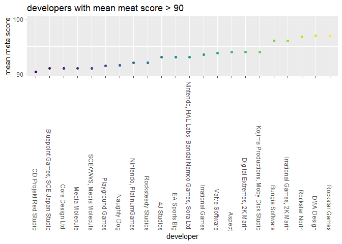
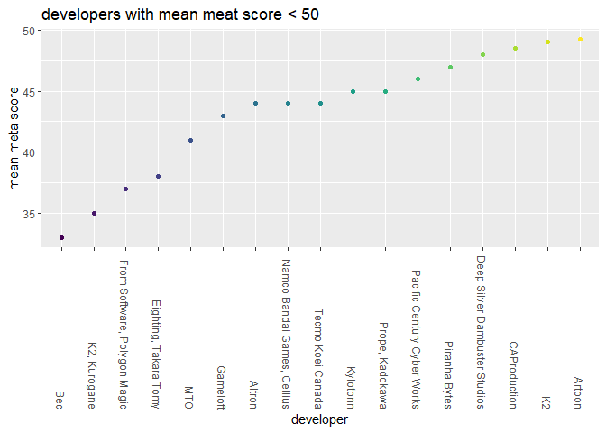
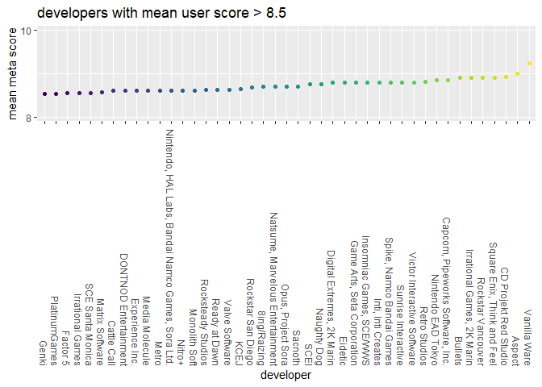
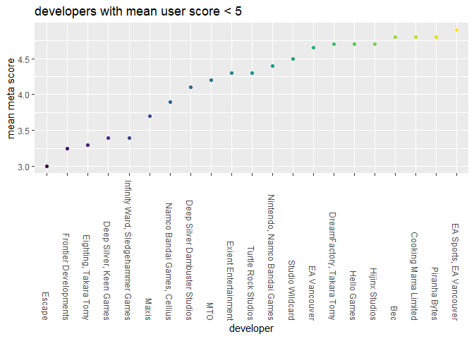

developer influence
================
Pengyuan Su (ps3195)
11/9/2020

### import data

``` r
game_df = 
  read_csv("game_2.csv") %>% 
  select(title, developer, meta_score, user_score, total_sale, na_sale, pal_sale, japan_sale, other_sale) %>% 
  group_by(developer) %>% 
  summarize(
    mean_meta = mean(meta_score),
    mean_user = mean(user_score),
    sum_total = sum(total_sale),
    mean_sale = mean(total_sale)
  ) %>% 
  mutate(
    developer = factor(developer)
  )
```

### developer vs mean meta

<!-- -->

<!-- -->

### developer vs mean user

<!-- -->

<!-- -->
